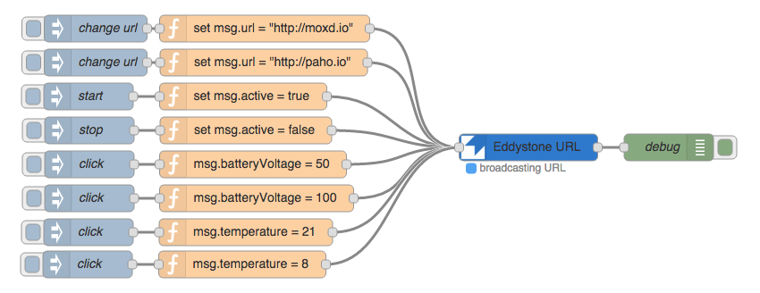

# node-red-contrib-eddystone

Create an [Eddystone](https://github.com/google/eddystone) Beacon using [Node-RED](http://nodered.org/).

[Eddystone-URL](https://github.com/google/eddystone/tree/master/eddystone-url) beacons can be used with the [Physical Web](http://google.github.io/physical-web/). Adding this node to your Node-RED setup allows easy prototyping for the Physical Web.

## Example
This flow allows to control a Eddystone URL beacon for setting the URL, starting and stopping broadcasting, setting temperature, and setting power. All parameters can be set by sending messages to the EddystoneURL node.

