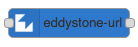
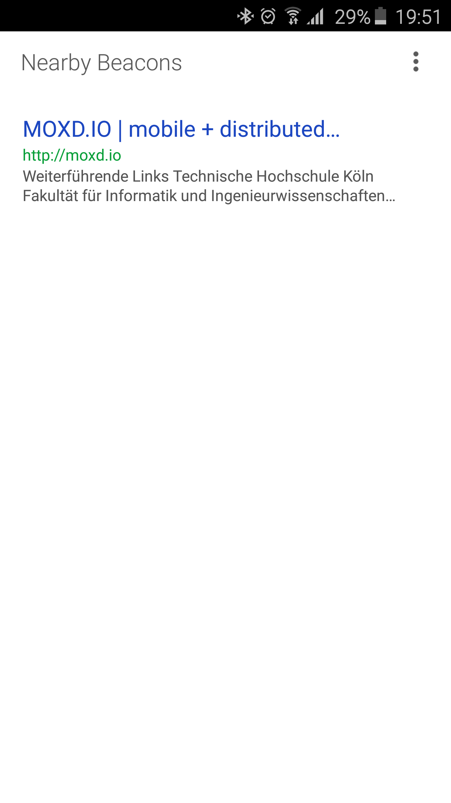
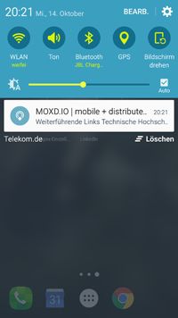

# node-red-contrib-eddystone



Create an [Eddystone](https://github.com/google/eddystone) Beacon using [Node-RED](http://nodered.org/). [Eddystone-URL](https://github.com/google/eddystone/tree/master/eddystone-url) beacons can be used with the [Physical Web](http://google.github.io/physical-web/). Add this node to your Node-RED environment for easy prototyping for the Physical Web.

## Installation

First install Node RED, if not done yet, and add node-red-contrib-eddystone:

```
npm install node-red -g
npm install node-red-contrib-eddystone -g
```

## Prerequisites

**node-red-contrib-eddystone** is based on the awesome [node-eddystone-beacon](https://github.com/don/node-eddystone-beacon). However, node-eddystone-beacon has the same [prerequesits](https://github.com/don/node-eddystone-beacon#prerequisites) you might want to check. 

You can install the prerequisite packages with the following command

```
sudo apt-get install -y bluetooth bluez libbluetooth-dev libudev-dev
```

On Linux Bluetooth LE requires root access to the hardware to work, you can achive this by running Node-RED as root or by setting the required flags on the node binary with the following command.

```
sudo setcap cap_net_raw+eip $(eval readlink -f `which node`)
```

setcap can be installed with the following command if needed

```
sudo apt-get install libcap2-bin
```

We recommend to use a Raspberry Pi with a Bluetooth 4.0 compatible USB dongle.

## Example
This flow allows to control a Eddystone URL beacon for setting the URL, starting and stopping broadcasting, setting temperature, and setting power. All parameters can be set by sending messages to the EddystoneURL node.


The official [Android App for The Physical Web](https://play.google.com/store/apps/details?id=physical_web.org.physicalweb) might me a nice addition for testing and playing around:



